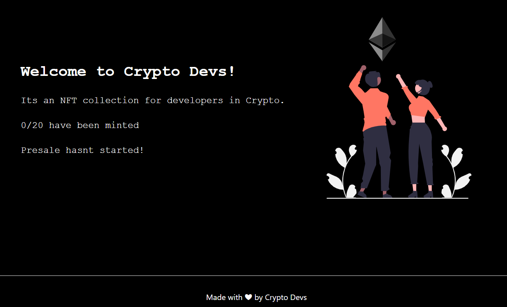
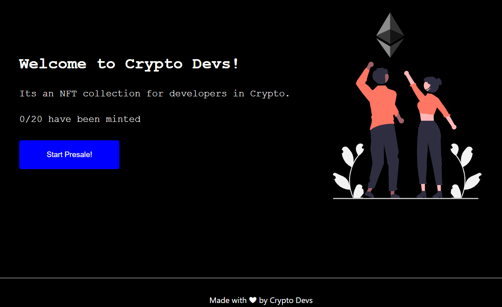
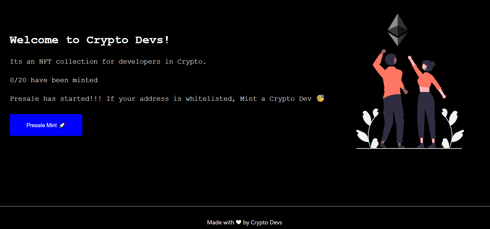

# Build a NFT Collection

This repo contains coursework project from [LearnWeb3](https://learnweb3.io/) completed by [0xsenzel](https://github.com/0xSenzel/) for [LearnWeb3DAO-Sophomore](https://learnweb3.io/courses/c1d7081b-63a9-4c6e-b35c-9fcbbad418b2) lesson.

## Project Info

NFT Collection allows whitelisted address from [Whitelist-Dapp](https://0xsenzel-whitelist-dapp.vercel.app/) to mint our NFT collection. The Dapp will be able to mint 20 different NFT based on the sequence of minter.

## Project Demo

<figure>

<p align="center">Fig.1 - Home Page When Login By Non-Owner Address Before Starting of Presale</p>
</figure>

<br/>

<figure>

<p align="center">Fig.2 - Home Page When Login By Owner Address Before Starting of Presale</p>
</figure>

<br/>

<figure>

<p align="center">Fig.3 - Home Page After Presale Started</p>
</figure>

## Project Setup

### Hardhat

Head to [hardhat-tutorial](./hardhat-tutorial/) folder:

Install dependencies

```
npm install
```

Compile smart contract

```
npx hardhat compile
```

To deploy smart contracts: <br/>
Head to [index.js](./hardhat-tutorial/constants/index.js) file, update the value of `WHITELIST_CONTRACT_ADDRESS` with your own deployed [Whitelist-Dapp](https://github.com/0xSenzel/Whitelist-Dapp)

Head to [hardhat.config.js](./hardhat-tutorial/hardhat.config.js) file, changed the value of `ALCHEMY_HTTP_URL` with your own Ethereum Network API & `PRIVATE_KEY` with Ethereum wallet's private key. Then run the following command.

```
npx hardhat run scripts/deploy.js --network goerli
```

### React & Next Js

Head to [my-app](./my-app/) folder:

```
npm install
```

Replace the variable inside with your respective deployed contract address and contract's compiled abi inside [this folder](./my-app/constants/index.js).

To run the app locally:

```
npm run dev
```
